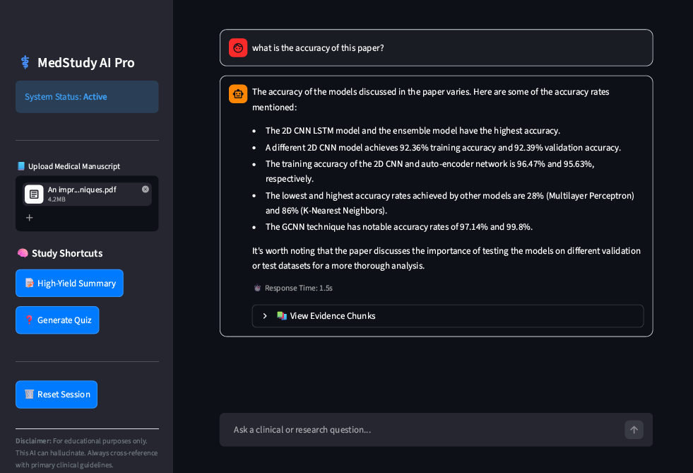

# 🩺 MedStudy AI Pro: Production-Grade Medical RAG Engine

### 🔗 [Live Demo on Hugging Face Spaces](https://huggingface.co/spaces/AYESHAASS/Medical-RAG-Assistant)


**MedStudy AI Pro** is a high-precision, context-isolated Retrieval-Augmented Generation (RAG) system engineered to ingest dense medical manuscripts and generate hallucination-resistant insights. Optimized for clinical precision, the platform mitigates cross-document context bleeding, optimizes memory utilization, and enforces rigid source grounding.


## 🏗️ System Architecture & Data Flow

```text
[User Uploads PDF] 
       │
       ▼
[In-Memory Text Extraction] ──► Non-blocking PyPDFLoader stream
       │
       ▼
[Optimized Semantic Chunking] ──► RecursiveCharacterSplitter (1000 tokens | 200 overlap)
       │
       ▼
[HuggingFace Embeddings] ──► Model: all-MiniLM-L6-v2 (384-dim dense vectors)
       │
       ▼
[In-Memory Vector Store] ──► ChromaDB/FAISS (Strict Ephemeral Isolation)
       │
       ▼
[Llama-3.3-70B Pipeline] ──► Temperature: 0.1 + Deterministic Grounding Prompt
       │
       ▼
[Streamlit UI Rendering] ──► Chat Interface + Verified Fragment Citations

## 📸 Application Interface


🚀 Technical Breakthroughs & Infrastructure
During the development of MedStudy AI Pro, several high-impact cloud infrastructure challenges were systematically engineered away to ensure production stability:

🔒 Zero-Leakage Ephemeral Storage
Standard vector databases persist data to disk, running a risk of context bleeding across separate user files. This engine decouples document tracking by spinning up an isolated, dynamic, in-memory index tied explicitly to the session state. Uploading a new manuscript instantly flushes memory references, ensuring absolute data privacy.

🌐 Bypassing Iframe 403 Rejections
Cloud platform dashboards often isolate web frameworks behind <iframe> layers, which can block binary file transport due to Cross-Origin (CORS) policies. This project routes user traffic directly to the raw application container network socket, restoring seamless binary data transport for large medical PDFs.

🧠 Anti-Hallucination Grounding Framework
To safely handle delicate clinical data, the inference pipeline utilizes a low-temperature constraint (T = 0.1) coupled with deterministic system instructions. The LLM is strictly prohibited from utilizing its pre-trained global weights for factual assertions, forcing it to fall back to a structured refusal string if semantic chunks lack direct factual coverage.

🛠️ Deep Tech Stack
LLM: llama-3.3-70b-versatile via high-speed LPU inference (Groq Cloud).
Orchestration: LangChain Core (RunnablePassthrough, ChatPromptTemplate).
Vector Embeddings: HuggingFace all-MiniLM-L6-v2.
Vector Store: ChromaDB / FAISS (In-Memory Implementation).
Frontend: Streamlit Framework (State Handling Session Hooks).

📦 Installation & Developer Setup
1. Prerequisites
Python 3.10 or higher.
A Groq Cloud API Key.

2. Setup
code
Bash
git clone https://github.com/AYESHAASS/Medical-RAG-Assistant.git
cd Medical-RAG-Assistant
python -m venv venv
source venv/bin/activate  # Windows: venv\Scripts\activate
pip install -r requirements.txt

3. Environment
Create a .env file in the root directory:
code
Text
GROQ_API_KEY=your_production_low_latency_groq_api_token

4. Run
code
Bash
streamlit run app.py

🔬 Rigorous Test Cases Passed
The system was evaluated against empirical medical literature to verify retrieval stability across three core stress vectors:
Exact Metric Ingestion: Successfully extracted complex statistics (e.g., 95% Confidence Intervals and Brier Scores) from compressed markdown tables.

Multi-Hop Synthesis: Mapped multi-layer neural network parameters (128, 64, 32) across distributed framework logs.
Out-of-Bounds Refusals: Corrected handled negative testing by refusing to answer questions not present in the uploaded manuscript.

⚖️ Disclaimer
This tool is for educational and research purposes only. It is not intended for clinical decision-making. Always consult primary clinical guidelines and human experts before making medical decisions.


📜 License
Distributed under the MIT License. See LICENSE for more information.
